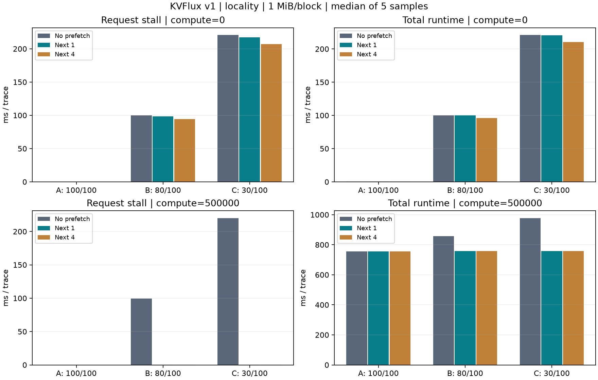
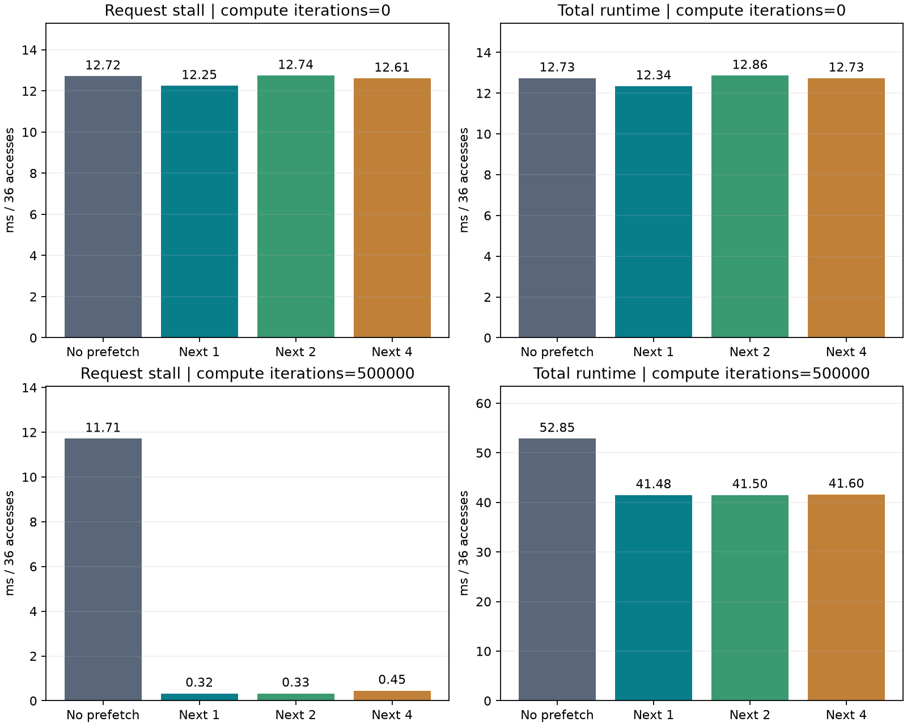
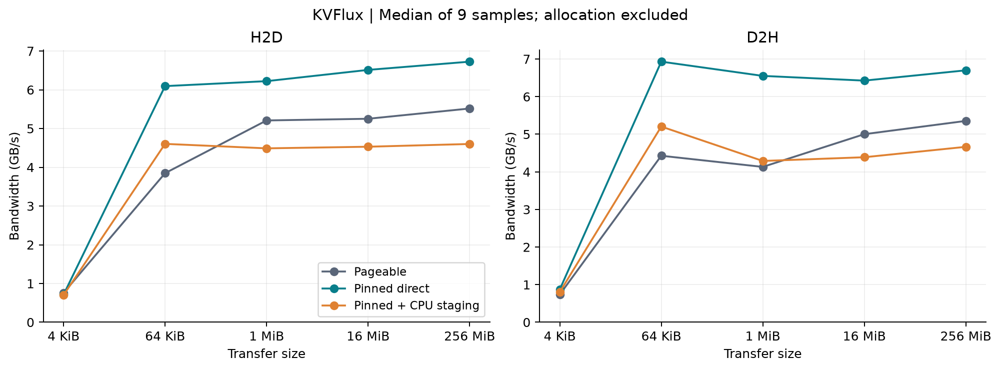

# KVFlux：v1 分层 KV Cache 与 v2 Reference Attention

KVFlux 是学习和实现 LLM 推理 KV cache 基础设施的独立项目。v0 用无第三方依赖的 C++17 实现 block 管理，主线是：**请求 token → 逻辑块 → 前缀查找 → 物理块分配/复用 → 引用释放 → LRU 回收**。

v2 已开始实施：[Milestone 1 Physical Block Pool](docs/v2_physical_block_pool.md) 将 v0 的分配器用于 GPU KV 物理页编号；[Milestone 2 Block Table](docs/v2_block_table.md) 用 vector 下标表示逻辑块，并映射到可共享的物理编号；[Milestone 3 SequenceState](docs/v2_sequence_state.md) 为每个请求记录 token 数和独立的逻辑块表；[Milestone 4 Dynamic Sequence Growth](docs/v2_dynamic_sequence_growth.md) 在 decode 跨块时才申请新物理页；[Milestone 5 Slot Mapping](docs/v2_slot_mapping.md) 把 batch token 位置转成连续的物理槽位编号数组；[Milestone 6 Paged KV Storage](docs/v2_paged_kv_storage.md) 把编号接到真实 GPU K/V 显存；[Milestone 7 Paged KV Write](docs/v2_paged_kv_write.md) 用 CUDA kernel 写入 batch 的新 K/V；[Milestone 8 Paged KV Read](docs/v2_paged_kv_read.md) 按请求的 Block Table 逐页读取 K/V；[Milestone 9 Reference Attention](docs/v2_reference_attention.md) 提供连续 K/V 的 CPU 正确性基准。请求调度和 paged attention kernel 仍属后续阶段。

## v2 Slot Mapping

控制面按 batch 顺序生成 `slot_mapping[i] = physical_block_id × block_size + offset_in_block`。例如 `block_size=16`，A 的 token 34 映射到 P81 得到 **1298**，B 的 token 17 映射到 P32 得到 **513**，C 的 token 80 映射到 P138 得到 **2208**。Paged KV Write kernel 已消费这段数组；详见 [接口、边界和示例](docs/v2_slot_mapping.md)。

## v2 Paged KV Storage

一层 K/V 使用 `K[num_blocks][num_kv_heads][block_size][head_size]` 与同形状的 V，K 区和 V 区在同一次 GPU 分配中连续存放。`PagedKVStorage` 复用 v1 `GpuMemoryPool` 的显存与地址接口，使用 v2 页池的物理编号；`slot_mapping` 可换算成 K/V 的真实设备地址。CPU 布局测试与真实 GPU 读回测试见 [布局、接口和复现](docs/v2_paged_kv_storage.md)。

## v2 Paged KV Write

控制面生成 `[173, 522, 944]` 三个非连续 slot；CUDA kernel 将设备端 `K_new/V_new[batch][kv_head][head_size]` 写入对应的 GPU K/V 页。真实 GPU 测试验证 FP16、BF16、FP32 逐字节回读和相邻槽位不被覆盖，见 [接口与运行示例](docs/v2_paged_kv_write.md)。

## v2 Paged KV Read

40 个 token、`block_size=16`、`BlockTable=[27, 3, 91]` 时，读取 kernel 将逻辑块 0、1、2 分别映射到 P27、P3、P91；只读取尾页的 8 个有效 token。输出是按请求 token 顺序排列的设备端 K/V，见 [接口、测试和示例](docs/v2_paged_kv_read.md)。

## v2 Reference Attention

连续 FP32 Q/K/V 在 CPU 上按 `QKᵀ → scale → causal mask → softmax → V` 得到基准输出。支持整段 prefill、末尾 Q 的 decode 和多个 Q 头共享一个 KV 头；后续 PagedAttention 的输出可逐元素计算 `max_error` 并与容差比较，见 [接口和测试](docs/v2_reference_attention.md)。

## v2 碎片化测试

8 页池先全部分配，再释放奇数页，得到：

```text
物理页       P0    P1    P2    P3    P4    P5    P6    P7
状态         used  free  used  free  used  free  used  free
```

此时有 4 页空闲，但最长连续空闲段只有 1 页。Request X 需要 4 个块（`block_size=16`、共 64 个 token），仍能建立 `BlockTable X = [1, 3, 5, 7]`。逻辑块按顺序排列，物理页无需连续；原先占用 `P0、P2、P4、P6` 的持有者也不受影响。请求销毁后，4 页重新可用。

```bash
cmake -S . -B build -DKVFLUX_BUILD_TESTS=ON
cmake --build build -j 2
ctest --test-dir build -V -R '^kvflux_fragmentation_tests$'
```

这个碎片化用例验证 v2 的物理页**元数据池**、请求和 Block Table；它在 CPU 上运行。真实 GPU K/V 存储另由 [Paged KV Storage 测试](docs/v2_paged_kv_storage.md)验证。

v1.0–v1.2 已在 v0 管理器上接入真实 GPU 显存池、统一 KV 布局和整块 Host ↔ GPU 读写。v1.3–v1.5 增加 pinned staging buffer、异步批量传输、compute/transfer streams 和真实性能基准。v1.6–v1.8 增加稳定逻辑块身份、GPU/CPU 分层、内存压力下的 LRU 搬迁，以及 next-N 预取。v1.9–v1.10 补齐 runtime metrics 和 A/B/C 完整实验，**v1 在单 GPU 内存运行时范围内完成**。尚未接入模型计算或 attention；不启用 CUDA 时，普通 CPU 仍可运行 v0 和容量估算。

## v1 最终验收

[六项 Definition of Done 与五个 Epic](docs/v1_completion.md) · [Metrics 定义和复现](docs/metrics_benchmarks.md) · [最终实验报告](benchmark/results/rtx3060-v1/report.md)

`manager.metrics()` 输出 GPU total/used/free、CPU cached blocks、双向字节数、CUDA event 传输 latency/bandwidth、offload/prefetch count、prefetch hit/miss/late/unused 和 request stall。

RTX 3060 Laptop，100 个逻辑块、1 MiB/块，同一局部性轨迹 660 次访问，无计算、无预取，5 次样本中位数：

| Workload | GPU 槽位 | Offloads / Reloads | 双向流量 | 总耗时 |
| --- | ---: | ---: | ---: | ---: |
| A：GPU 充足 | 100 | 0 / 0 | 0 MiB | 0.25 ms |
| B：轻度压力 | 80 | 300 / 300 | 600 MiB | 100.08 ms |
| C：重度压力 | 30 | 660 / 660 | 1320 MiB | 220.89 ms |

有模拟计算窗口时，next-1 将 C 的 stall 从 **219.98 ms 降到 0.35 ms**，总耗时从 **977.03 ms 降到 757.62 ms**，但流量仍为 **1320 MiB**。预取隐藏等待，并未消除 thrashing。循环扫描对照中，80/100 和 30/100 都会每次 miss。

最终实验包含 **36 个配置、180 个样本**，保存访问序列、原始 CSV、中位数和 PNG/SVG；同时重跑 pageable/pinned、sync/async overlap 和 batch 基准。CPU **2/2**、CUDA **5/5** 测试通过，异步及分层路径的 Compute Sanitizer **0 错误、0 泄漏**。



v1 的边界是单 GPU、GPU/CPU 分层；不包含 PagedAttention kernel、Transformer forward、continuous batching、分布式缓存、RDMA、NVMe、多 GPU、vLLM/SGLang 集成、KV 压缩或量化。

## v1.6–v1.8 阶段验收

[接口与复现说明](docs/tiered_cache.md) · [真实 GPU 报告、CSV 与图表](benchmark/results/rtx3060-prefetch/report.md)

- **Offload/load**：逻辑句柄在迁移中保持不变，位置为 `GPU_RESIDENT` / `CPU_RESIDENT` / `TRANSFERRING`，支持双向逐字节回读。
- **8 槽位 / 12 块压力**：GPU 满后按 LRU 搬出 4 块，最终 GPU=8、CPU=4；GPU lease 保护正在计算的块。
- **Prefetch next N**：满池时异步搬出 LRU，再由 `poll()` 推进排队装入；比较无预取和 next-1/2/4。

RTX 3060 Laptop、1 MiB/块、36 次访问、7 次样本中位数：有模拟计算窗口时，next-1 的累计 request stall 从 **11.71 ms 降到 0.324 ms（97.2%）**，总耗时从 **52.85 ms 降到 41.48 ms**。无计算窗口时提升很小，next-2 略慢；这些结果不代表真实模型吞吐收益。



## v1.3–v1.5 性能结果

[完整实测报告与图表](benchmark/results/rtx3060/report.md) · [异步接口和复现说明](docs/async_transfer.md)

本机 RTX 3060 Laptop 的 256 MiB H2D：普通内存 **5.52 GB/s**，直接 pinned **6.73 GB/s**，包含 CPU staging **4.60 GB/s**。16 MiB 传输 + 模拟计算的总耗时由 **3.61 ms** 降到 **2.41 ms**。收益取决于数据来源和工作负载，不能只凭用了 pinned/async 就断言更快。



## GPU 版本快速开始

```bash
cmake -S . -B build-cuda -DKVFLUX_ENABLE_CUDA=ON \
  -DKVFLUX_BUILD_TESTS=ON -DCMAKE_BUILD_TYPE=Debug
cmake --build build-cuda -j 2
ctest --test-dir build-cuda --output-on-failure
./build-cuda/kvflux_gpu_demo
./build-cuda/kvflux_async_demo
./build-cuda/kvflux_tiered_demo
./build-cuda/kvflux_capacity 1
```

底层 GPU 池只在初始化时申请一次连续显存，物理 `BlockId` 映射到 `base + id × block_bytes`。分层管理器的 `LogicalBlockHandle` 独立于物理槽位，通过 location 和 GPU lease 访问数据。第一版为每个逻辑槽位预留 pinned CPU backing，配置 GPU=8、CPU backing=12 表示最多 12 个唯一逻辑块。支持 FP16/BF16/FP32 的统一 `[K/V][layer][kv_head][token][head_dim]` 布局。详细接口、公式、所有权和测试见 [GPU 内存池说明](docs/gpu_memory_pool.md) 和 [分层说明](docs/tiered_cache.md)。

容量示例：32 层、8 个 KV heads、head_dim=128、block_size=16、FP16 时，每块 2 MiB；1 GiB 预算容纳 512 块，即 8192 个 token 槽位。估算不需要 GPU，也不包含模型权重开销。

## 已实现

| 模块 | 行为 |
| --- | --- |
| Block allocator | 固定容量槽位池，返回带 generation 的句柄 |
| Free list | 自行实现槽位内单向链表，O(1) 分配和归还未缓存块 |
| Reference counting | 请求共享块，最后一个引用释放后才允许回收 |
| LRU | 自行实现槽位内双向链表，管理零引用的完整缓存块 |
| Prefix hash | 自行实现 FNV-1a，哈希完整上下文，精确比较处理碰撞 |
| KV block lookup | 前缀 → 缓存块；token 位置 → block table → 物理块 |
| GPU memory pool | 固定容量一次分配，按 BlockId 定位真实显存，复用 v0 分配器 |
| KV layout | 统一布局、dtype 字节数、溢出检查、预算容量估算 |
| Block read/write | 同步整块复制，初始化状态与共享/发布写保护 |
| Pinned buffer | 可复用的 page-locked host staging，支持 normal ↔ pinned 拷贝 |
| Async transfer | 两条 non-blocking streams、批量 H2D/D2H、在途引用与 buffer 保护 |
| Tiered block manager | 稳定逻辑句柄，三态位置，GPU ↔ pinned CPU 迁移 |
| Memory pressure | 复用 v0 链表 LRU 策略搬迁 GPU 块，lease 防止计算期间回收 |
| Prefetch | Next-N 窗口、满池槽位预约、poll/wait 推进、重复请求合并 |
| Runtime metrics | 容量 gauges、累计迁移字节/时间、事件复用、预取效果与等待统计 |
| A/B/C Benchmark Suite | 100/80/30 槽位，局部性/循环扫描，0/1/4 预取，有/无计算窗口 |
| 性能基准 | 5 种大小、同步/异步计算重叠、1–32 块 batch，CSV + PNG/SVG |
| v0 模拟序列接口 | acquire、share、release，支持私有尾块和失败引用回滚 |

哈希桶使用标准库 `std::unordered_map`，没有额外实现通用哈希容器。

## CPU 版本构建、运行、测试

需要 CMake 3.20+ 和支持 C++17 的编译器。

```bash
cmake -S . -B build -DCMAKE_BUILD_TYPE=Debug -DKVFLUX_BUILD_TESTS=ON
cmake --build build -j 2
ctest --test-dir build --output-on-failure
./build/kvflux_demo
```

示例预期输出：

```text
shared prefix blocks: 2
token 4 -> physical block 3, offset 0
free=2 active=0 cached_idle=2
```

使用方式：

```cpp
#include "kvflux/block_manager.h"

int main() {
    kvflux::BlockManager manager(4, 2); // 4 个物理块，每块 2 个 token
    auto a = manager.acquire({10, 20, 30, 40, 50});
    auto b = manager.acquire({10, 20, 30, 40, 60});
    // a 与 b 共享前两个完整块，尾部各使用一个私有块。
    auto h = manager.block_at(b, 4); // token 下标从 0 开始
    (void)h;
    manager.release(a);
    manager.release(b);
}
```

在 CMake 中链接 `KVFlux::kvflux` 即可使用。`BlockTable` 是显式管理引用的描述表，不是 RAII 所有者；必须调用 `release`。需要新增共享所有权时使用 `manager.share(table)`，普通 C++ 复制只复制描述，不增加引用。句柄和表只能交给创建它们的 manager；本版不检测跨 manager 误用，也不支持并发调用。

## 阅读路线

v2 从 [物理页池说明](docs/v2_physical_block_pool.md)、[Block Table 说明](docs/v2_block_table.md)、[SequenceState 说明](docs/v2_sequence_state.md)、[动态增长说明](docs/v2_dynamic_sequence_growth.md)、[Slot Mapping 说明](docs/v2_slot_mapping.md)、[Paged KV Storage 说明](docs/v2_paged_kv_storage.md)、[Paged KV Write 说明](docs/v2_paged_kv_write.md)、[Paged KV Read 说明](docs/v2_paged_kv_read.md) 和 [Reference Attention 说明](docs/v2_reference_attention.md) 开始，再看对应的 [物理页池接口](include/kvflux/physical_block_pool.h)、[Block Table 接口](include/kvflux/v2/block_table.h)、[请求接口](include/kvflux/v2/sequence_state.h)、[Slot Mapping 接口](include/kvflux/v2/slot_mapping.h)、[存储接口](include/kvflux/v2/paged_kv_storage.h)、[写入接口](include/kvflux/v2/paged_kv_write.h)、[读取接口](include/kvflux/v2/paged_kv_read.h)、[Reference Attention 接口](include/kvflux/v2/reference_attention.h) 和示例。

1. [项目主线](docs/project_mainline.md)：请求生命周期与后续版本路线。
2. [设计与接口说明](docs/design.md)：状态机、数据结构、所有权、错误处理与复杂度。
3. [初学者导读](docs/learning_guide.md)：代码阅读顺序、注释写法与测试说明。
4. [GPU 内存池说明](docs/gpu_memory_pool.md) 与 [优化检查](docs/optimization_review.md)。
5. [分层缓存与预取](docs/tiered_cache.md)：逻辑身份、迁移状态机、压力调度和等待时间实测。
6. [运行示例](examples/basic.cpp)、[公共接口](include/kvflux/block_manager.h)、[核心实现](src/block_manager.cpp)、[测试](tests/block_manager_test.cpp)。
7. [Metrics 与最终实验](docs/metrics_benchmarks.md)、[v1 完成验收与边界](docs/v1_completion.md)。

## 微基准

```bash
cmake -S . -B build-release -DCMAKE_BUILD_TYPE=Release \
  -DKVFLUX_BUILD_TESTS=ON -DKVFLUX_BUILD_BENCHMARKS=ON
cmake --build build-release -j 2
ctest --test-dir build-release --output-on-failure
./build-release/benchmark/kvflux_benchmark
```

基准测量固定 512-token 前缀热缓存下的 acquire + release，不代表真实模型吞吐量，也不含 GPU 运算。

## 仓库边界

`include/` 放公共头文件，`src/` 放实现，`examples/` 放示例，`tests/` 放正确性测试，`benchmark/` 放微基准，`docs/` 放中文说明。

CUDA 学习实验继续放在独立的 `ai-infra-learning` 仓库。上游 `nano-vllm` 应放在本仓库旁边，`integration/nano_vllm/` 只存 KVFlux 的适配代码和补丁；当前尚未集成模型推理。
