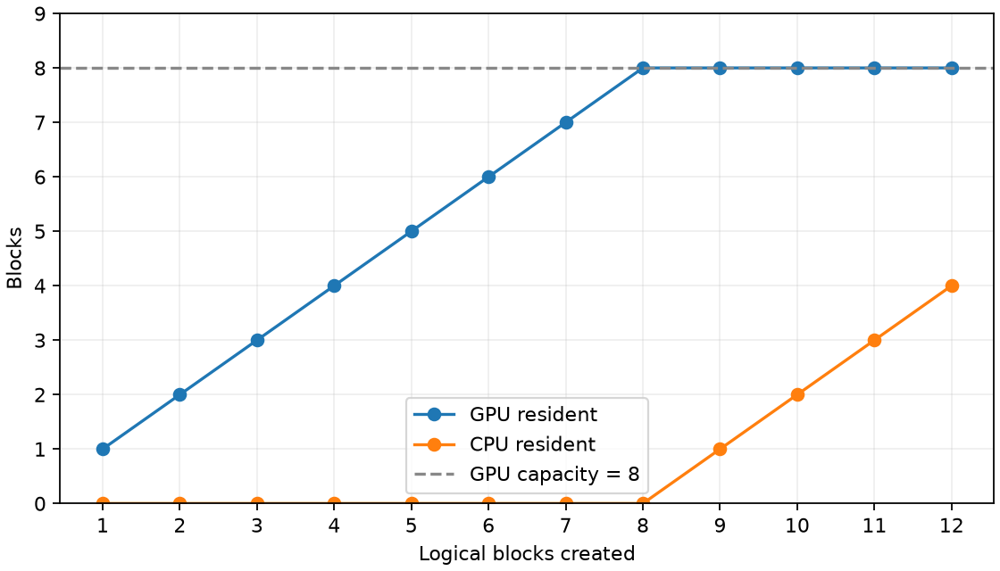

# v1.6–v1.8：GPU/CPU 分层和预取实测

环境见 [environment.txt](environment.txt)。每块 1 MiB，8 个 GPU 槽位、12 个逻辑块，顺序访问 3 遍。
每个模式预热一次，轮换顺序测量 7 个样本；下表为各指标的样本中位数。

创建 12 块后 GPU resident=8、CPU resident=4，LRU 搬出 4 块；迁移后逐字节校验通过。

| Compute iterations | Lookahead | Stall (ms) | 相对无预取降低 | Total (ms) | P95 stall (µs) | Scheduler CPU (ms) |
| ---: | ---: | ---: | ---: | ---: | ---: | ---: |
| 0 | 0 | 12.716 | 0.0% | 12.733 | 439.36 | 0.001 |
| 0 | 1 | 12.246 | 3.7% | 12.342 | 391.40 | 0.080 |
| 0 | 2 | 12.742 | -0.2% | 12.858 | 784.94 | 0.095 |
| 0 | 4 | 12.607 | 0.9% | 12.727 | 1503.74 | 0.095 |
| 500000 | 0 | 11.712 | 0.0% | 52.849 | 359.11 | 2.257 |
| 500000 | 1 | 0.324 | 97.2% | 41.477 | 0.08 | 8.581 |
| 500000 | 2 | 0.326 | 97.2% | 41.504 | 0.07 | 8.618 |
| 500000 | 4 | 0.449 | 96.2% | 41.598 | 118.89 | 8.439 |

Stall 为 acquire_gpu 的 host wall time 之和，包含按需搬出/装入和接口开销；负的降低百分比表示变慢。
Total 包含预取提交、计算、轮询和尾部迁移，不能仅凭 stall 减少断言端到端加速。
Scheduler CPU 是 prefetch/poll 调用耗时之和，不包含全部 query 循环 CPU 开销。

计算使用独立 scratch 上的 fake compute，不执行 attention。compute=0 用于观察没有计算重叠窗口时的开销。
这是本机合成访问轨迹的实测；7 次样本不代表跨设备、跨负载的收益保证。

原始数据：[汇总](prefetch.csv)、[逐次样本及迁移计数](prefetch_samples.csv)、[压力轨迹](pressure.csv)。
同目录提供 SVG 图。复现命令和接口约定见 [分层缓存说明](../../../docs/tiered_cache.md)。
