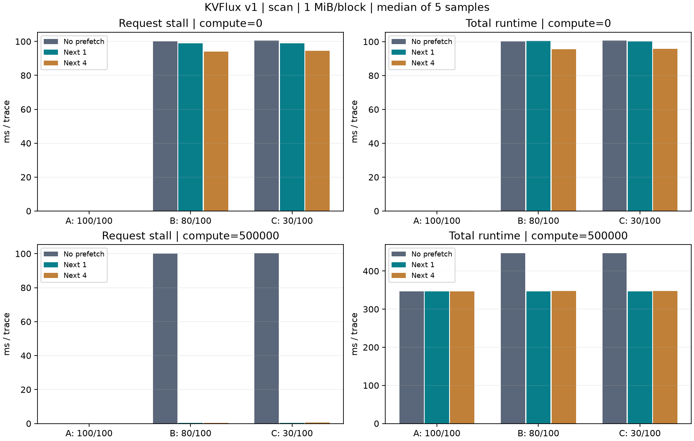
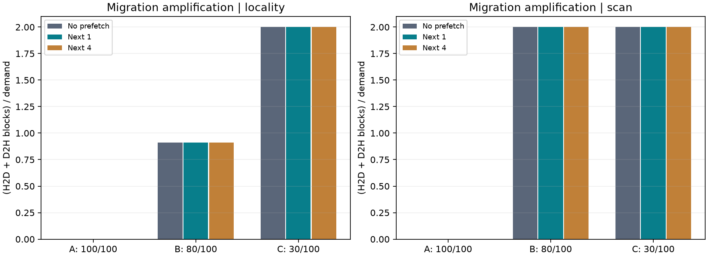

# KVFlux v1 最终实验：Metrics 与 A/B/C Benchmark Suite

[环境](environment.txt) · [原始 180 个样本](cache_samples.csv) · [汇总 CSV](cache_summary.csv)

固定 100 个逻辑块、每块 1 MiB，A/B/C 的 GPU 容量分别为 100/80/30 块。CPU 为全部 100 块预留 pinned backing。
每个配置预热一次，再轮换容量与预取模式顺序采样 5 次。表中每个指标单独取中位数，原始数据保留波动。
初始化及最终逐字节校验不计入时间/计数增量；每次样本均检查数据、容量和 metrics 守恒。

## 主实验：局部性与容量

`([0..59] × 3 + [60..99]) × 3`，共 660 次访问；60 块热集合在 B 中放得下，在 C 中放不下。
A/B/C 使用完全相同的访问序列、数据和计算量，区别只有 GPU 容量。

| Workload | Compute | Prefetch | Total ms | Stall ms | Offloads | Reloads | Traffic MiB | Hit / Miss / Late |
| --- | ---: | ---: | ---: | ---: | ---: | ---: | ---: | --- |
| A | 0 | 0 | 0.25 | 0.02 | 0 | 0 | 0 | 0 / 0 / 0 |
| A | 0 | 1 | 0.26 | 0.02 | 0 | 0 | 0 | 0 / 0 / 0 |
| A | 0 | 4 | 0.28 | 0.02 | 0 | 0 | 0 | 0 / 0 / 0 |
| A | 500000 | 0 | 756.65 | 0.02 | 0 | 0 | 0 | 0 / 0 / 0 |
| A | 500000 | 1 | 756.71 | 0.02 | 0 | 0 | 0 | 0 / 0 / 0 |
| A | 500000 | 4 | 756.62 | 0.02 | 0 | 0 | 0 | 0 / 0 / 0 |
| B | 0 | 0 | 100.08 | 99.83 | 300 | 300 | 600 | 0 / 300 / 0 |
| B | 0 | 1 | 100.18 | 98.66 | 300 | 300 | 600 | 0 / 300 / 299 |
| B | 0 | 4 | 95.71 | 94.11 | 300 | 300 | 600 | 224 / 76 / 75 |
| B | 500000 | 0 | 856.49 | 99.66 | 300 | 300 | 600 | 0 / 300 / 0 |
| B | 500000 | 1 | 757.29 | 0.35 | 300 | 300 | 600 | 299 / 1 / 0 |
| B | 500000 | 4 | 757.34 | 0.47 | 300 | 300 | 600 | 298 / 2 / 1 |
| C | 0 | 0 | 220.89 | 220.63 | 660 | 660 | 1320 | 0 / 660 / 0 |
| C | 0 | 1 | 220.41 | 217.42 | 660 | 660 | 1320 | 0 / 660 / 659 |
| C | 0 | 4 | 210.30 | 207.19 | 660 | 660 | 1320 | 494 / 166 / 165 |
| C | 500000 | 0 | 977.03 | 219.98 | 660 | 660 | 1320 | 0 / 660 / 0 |
| C | 500000 | 1 | 757.62 | 0.35 | 660 | 660 | 1320 | 659 / 1 / 0 |
| C | 500000 | 4 | 757.69 | 0.47 | 660 | 660 | 1320 | 658 / 2 / 1 |

## 迁移开销与压力

以下使用无计算、无预取的相同局部性轨迹，减去 A 的总耗时作为额外开销。它包含迁移、元数据和同步，不能解释为纯 PCIe 时间。

| Workload | Total ms | 相对 A 额外 ms | 迁移/访问 | D2H µs/block | H2D µs/block | D2H GB/s | H2D GB/s | Event time / total |
| --- | ---: | ---: | ---: | ---: | ---: | ---: | ---: | ---: |
| A | 0.25 | 0.00 | 0.000 | 0.00 | 0.00 | 0.00 | 0.00 | 0.0% |
| B | 100.08 | 99.83 | 0.909 | 162.43 | 157.71 | 6.46 | 6.65 | 95.9% |
| C | 220.89 | 220.64 | 2.000 | 162.95 | 158.41 | 6.43 | 6.62 | 96.0% |

传输 latency 是 CUDA event 区间平均值，带宽为完成字节数 / 累计 event 时间，GB/s 使用十进制。
无迁移时输出 0，表示没有传输样本。Event 区间可能包含主机提交间隙；其占比不是 PCIe 利用率，也不能证明物理链路已饱和。

## Thrashing 对照：循环扫描

`[0..99] × 3`，共 300 次访问。循环工作集比 GPU 容量大时，LRU 在 80/100 下也可能每次 miss。
此对照防止把容量比例直接当作命中率；压力表现还依赖复用距离。

| Workload | Prefetch | Offloads | Reloads | MiB | 迁移/访问 | 无计算总耗时 ms |
| --- | ---: | ---: | ---: | ---: | ---: | ---: |
| A | 0 | 0 | 0 | 0 | 0.000 | 0.12 |
| A | 1 | 0 | 0 | 0 | 0.000 | 0.13 |
| A | 4 | 0 | 0 | 0 | 0.000 | 0.13 |
| B | 0 | 300 | 300 | 600 | 2.000 | 100.22 |
| B | 1 | 300 | 300 | 600 | 2.000 | 100.40 |
| B | 4 | 300 | 300 | 600 | 2.000 | 95.52 |
| C | 0 | 300 | 300 | 600 | 2.000 | 100.57 |
| C | 1 | 300 | 300 | 600 | 2.000 | 100.27 |
| C | 4 | 300 | 300 | 600 | 2.000 | 95.84 |

## 预取是否有意义

- B、有计算窗口、next-1：stall 99.66 → 0.35 ms（降低 99.6%），total 856.49 → 757.29 ms；流量 600 → 600 MiB。
- C、有计算窗口、next-1：stall 219.98 → 0.35 ms（降低 99.8%），total 977.03 → 757.62 ms；流量 1320 → 1320 MiB。

预取可以把部分传输等待移进计算窗口，但不能自动消除容量不足造成的来回迁移。无计算窗口的结果用于观察调度成本和批量等待。
计算为独立 scratch 上的合成 kernel，不是 attention；表中的 request 是一次 block demand，不是完整 LLM 请求。
Prefetch hit 只计一次及时使用；miss 是 demand 到来时未就绪，late 是 miss 的子集；普通 GPU 命中不算 prefetch hit。
P95、scheduler CPU time、unused、各方向字节数和最终容量均保存在 CSV。

## 传输与重叠基线

同次版本的 pageable/pinned/staging、sync/async overlap、batch 实验见 [传输报告](transfer/report.md)。
[v1 范围与六项验收](../../../docs/v1_completion.md) · [Metrics 定义与复现](../../../docs/metrics_benchmarks.md)
