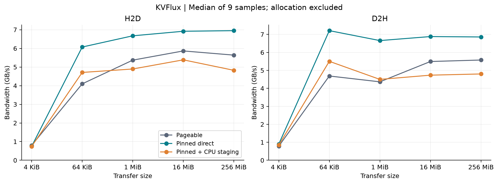
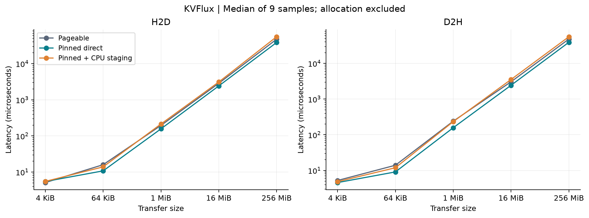
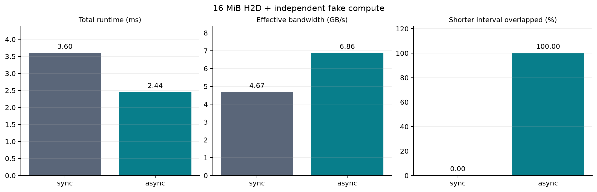
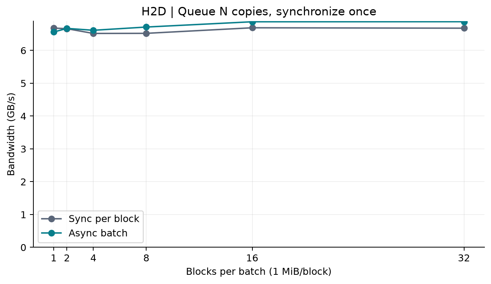

# KVFlux 实测基准

环境见 [environment.txt](environment.txt)。所有数值为 9 个样本的中位数；分配和预热不计时。

| Size | Direction | Mode | Latency (µs) | Bandwidth (GB/s) |
| --- | --- | --- | ---: | ---: |
| 4 KiB | H2D | pageable | 5.12 | 0.800 |
| 4 KiB | H2D | pinned_direct | 5.48 | 0.747 |
| 4 KiB | H2D | pinned_staged | 5.52 | 0.742 |
| 4 KiB | D2H | pageable | 5.23 | 0.783 |
| 4 KiB | D2H | pinned_direct | 4.57 | 0.896 |
| 4 KiB | D2H | pinned_staged | 4.85 | 0.844 |
| 64 KiB | H2D | pageable | 15.99 | 4.097 |
| 64 KiB | H2D | pinned_direct | 10.79 | 6.072 |
| 64 KiB | H2D | pinned_staged | 13.92 | 4.709 |
| 64 KiB | D2H | pageable | 13.99 | 4.686 |
| 64 KiB | D2H | pinned_direct | 9.09 | 7.209 |
| 64 KiB | D2H | pinned_staged | 11.91 | 5.503 |
| 1 MiB | H2D | pageable | 195.31 | 5.369 |
| 1 MiB | H2D | pinned_direct | 157.12 | 6.674 |
| 1 MiB | H2D | pinned_staged | 214.25 | 4.894 |
| 1 MiB | D2H | pageable | 240.37 | 4.362 |
| 1 MiB | D2H | pinned_direct | 157.53 | 6.657 |
| 1 MiB | D2H | pinned_staged | 233.13 | 4.498 |
| 16 MiB | H2D | pageable | 2861.82 | 5.862 |
| 16 MiB | H2D | pinned_direct | 2425.32 | 6.918 |
| 16 MiB | H2D | pinned_staged | 3115.65 | 5.385 |
| 16 MiB | D2H | pageable | 3054.87 | 5.492 |
| 16 MiB | D2H | pinned_direct | 2438.56 | 6.880 |
| 16 MiB | D2H | pinned_staged | 3544.98 | 4.733 |
| 256 MiB | H2D | pageable | 47610.87 | 5.638 |
| 256 MiB | H2D | pinned_direct | 38623.20 | 6.950 |
| 256 MiB | H2D | pinned_staged | 55653.54 | 4.823 |
| 256 MiB | D2H | pageable | 48149.43 | 5.575 |
| 256 MiB | D2H | pinned_direct | 39145.75 | 6.857 |
| 256 MiB | D2H | pinned_staged | 55922.57 | 4.800 |

| Mode | Total (ms) | Transfer (ms) | Compute (ms) | Effective GB/s | Overlap |
| --- | ---: | ---: | ---: | ---: | ---: |
| sync | 3.595 | 2.439 | 1.145 | 4.667 | 0.0% |
| async | 2.444 | 2.435 | 1.155 | 6.863 | 100.0% |

Overlap 是两个 CUDA event 区间交集 / 较短区间长度，不是 GPU 利用率；effective bandwidth 使用包含计算的总 wall time。

| Mode | Blocks | Total (µs) | Bandwidth (GB/s) |
| --- | ---: | ---: | ---: |
| sync_per_block | 1 | 156.94 | 6.681 |
| async_batch | 1 | 159.84 | 6.560 |
| sync_per_block | 2 | 314.78 | 6.662 |
| async_batch | 2 | 314.36 | 6.671 |
| sync_per_block | 4 | 643.57 | 6.517 |
| async_batch | 4 | 634.17 | 6.614 |
| sync_per_block | 8 | 1286.45 | 6.521 |
| async_batch | 8 | 1249.70 | 6.713 |
| sync_per_block | 16 | 2507.73 | 6.690 |
| async_batch | 16 | 2440.91 | 6.873 |
| sync_per_block | 32 | 5024.90 | 6.678 |
| async_batch | 32 | 4880.39 | 6.875 |

CSV：[传输](transfers.csv)、[重叠](overlap.csv)、[批量](batch.csv)。同目录包含 SVG 矢量图，便于导出。

这些是本机微基准，不能外推成模型吞吐收益；host 内存/PCIe/时钟和工作负载会影响结果。
