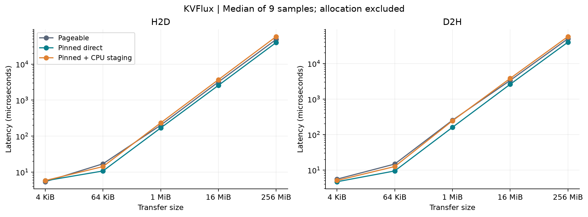
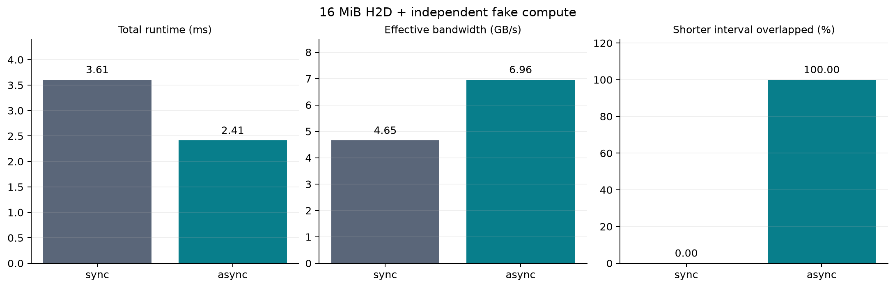
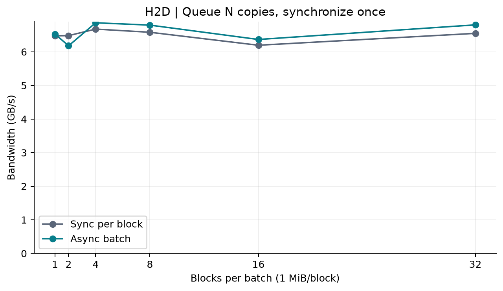

# KVFlux 实测基准

环境见 [environment.txt](environment.txt)。所有数值为 9 个样本的中位数；分配和预热不计时。

| Size | Direction | Mode | Latency (µs) | Bandwidth (GB/s) |
| --- | --- | --- | ---: | ---: |
| 4 KiB | H2D | pageable | 5.41 | 0.758 |
| 4 KiB | H2D | pinned_direct | 5.75 | 0.712 |
| 4 KiB | H2D | pinned_staged | 5.84 | 0.702 |
| 4 KiB | D2H | pageable | 5.55 | 0.738 |
| 4 KiB | D2H | pinned_direct | 4.70 | 0.872 |
| 4 KiB | D2H | pinned_staged | 5.10 | 0.803 |
| 64 KiB | H2D | pageable | 17.03 | 3.847 |
| 64 KiB | H2D | pinned_direct | 10.75 | 6.095 |
| 64 KiB | H2D | pinned_staged | 14.23 | 4.604 |
| 64 KiB | D2H | pageable | 14.80 | 4.428 |
| 64 KiB | D2H | pinned_direct | 9.46 | 6.931 |
| 64 KiB | D2H | pinned_staged | 12.59 | 5.205 |
| 1 MiB | H2D | pageable | 201.30 | 5.209 |
| 1 MiB | H2D | pinned_direct | 168.50 | 6.223 |
| 1 MiB | H2D | pinned_staged | 233.61 | 4.489 |
| 1 MiB | D2H | pageable | 253.80 | 4.131 |
| 1 MiB | D2H | pinned_direct | 160.04 | 6.552 |
| 1 MiB | D2H | pinned_staged | 244.44 | 4.290 |
| 16 MiB | H2D | pageable | 3194.40 | 5.252 |
| 16 MiB | H2D | pinned_direct | 2575.80 | 6.513 |
| 16 MiB | H2D | pinned_staged | 3703.23 | 4.530 |
| 16 MiB | D2H | pageable | 3354.33 | 5.002 |
| 16 MiB | D2H | pinned_direct | 2610.65 | 6.426 |
| 16 MiB | D2H | pinned_staged | 3822.94 | 4.389 |
| 256 MiB | H2D | pageable | 48657.86 | 5.517 |
| 256 MiB | H2D | pinned_direct | 39911.36 | 6.726 |
| 256 MiB | H2D | pinned_staged | 58339.70 | 4.601 |
| 256 MiB | D2H | pageable | 50134.07 | 5.354 |
| 256 MiB | D2H | pinned_direct | 40066.18 | 6.700 |
| 256 MiB | D2H | pinned_staged | 57539.19 | 4.665 |

| Mode | Total (ms) | Transfer (ms) | Compute (ms) | Effective GB/s | Overlap |
| --- | ---: | ---: | ---: | ---: | ---: |
| sync | 3.605 | 2.453 | 1.140 | 4.653 | 0.0% |
| async | 2.412 | 2.403 | 1.153 | 6.957 | 100.0% |

Overlap 是两个 CUDA event 区间交集 / 较短区间长度，不是 GPU 利用率；effective bandwidth 使用包含计算的总 wall time。

| Mode | Blocks | Total (µs) | Bandwidth (GB/s) |
| --- | ---: | ---: | ---: |
| sync_per_block | 1 | 161.91 | 6.476 |
| async_batch | 1 | 160.63 | 6.528 |
| sync_per_block | 2 | 323.58 | 6.481 |
| async_batch | 2 | 339.41 | 6.179 |
| sync_per_block | 4 | 628.29 | 6.676 |
| async_batch | 4 | 611.09 | 6.864 |
| sync_per_block | 8 | 1274.63 | 6.581 |
| async_batch | 8 | 1234.74 | 6.794 |
| sync_per_block | 16 | 2708.06 | 6.195 |
| async_batch | 16 | 2635.11 | 6.367 |
| sync_per_block | 32 | 5124.09 | 6.548 |
| async_batch | 32 | 4933.56 | 6.801 |

CSV：[传输](transfers.csv)、[重叠](overlap.csv)、[批量](batch.csv)。同目录包含 SVG 矢量图，便于导出。

这些是本机微基准，不能外推成模型吞吐收益；host 内存/PCIe/时钟和工作负载会影响结果。
