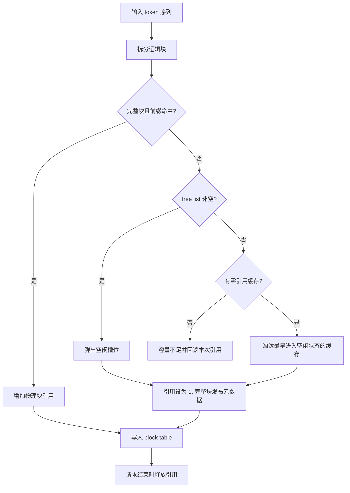

# 项目主线：先把 block 的生命周期做正确

## 为什么要分块

自回归模型生成新 token 时会重用历史 token 的 K/V。每个请求都按最大长度单独预留空间会浪费容量；按固定 token 数分块，可以让请求按需获得物理块，并共享内容相同的前缀。

v0 的核心问题是：**谁在使用哪个块，哪些块可以复用，容量不足时可以回收谁？** 模型计算、张量布局和设备分配留给后续版本。

## 一个请求如何走完整条路径

设 `capacity=4`，`block_size=2`，请求 A 为 `[10,20,30,40,50]`。

1. `acquire` 将请求分成 `[10,20]`、`[30,40]`、`[50]` 三个逻辑块。
2. 第一个块按完整前缀 `[10,20]` 查询；未命中，从 free list 分配槽位 0，引用数设为 1，然后发布缓存元数据。
3. 第二个块按 `[10,20,30,40]` 查询；未命中，使用槽位 1。不能仅用 `[30,40]` 查询，因为 K/V 依赖之前的上下文。
4. `[50]` 不足一块，使用槽位 2，但不进入前缀索引。得到 block table `[0,1,2]`。
5. 请求 B `[10,20,30,40,60]` 复用槽位 0、1，各增加一次引用；尾块使用槽位 3。
6. A 结束：槽位 0、1 仍被 B 引用；槽位 2 没有缓存身份，直接回 free list。
7. B 结束：槽位 0、1 引用归零，依次加入 LRU 尾端；槽位 3 回 free list。
8. 下次分配优先使用 free list。free list 耗尽后，淘汰 LRU 头部的零引用块，删除旧前缀索引，再复用物理槽位。

## v0 的交付边界

已完成固定容量分配、链表管理、引用共享、完整前缀缓存、碰撞处理、token 位置查询、回滚、测试、示例和微基准。

`acquire` 是元数据模拟接口，它假设完整块已经可以使用，因此马上发布。真实推理必须先 `lookup`，未命中时 `allocate`，等后端计算完并确认 K/V 可读后再 `publish`。发布前不能让其他请求命中尚未完成的 K/V。

当前每个 manager 对应一个固定模型、适配器和位置编码配置。仅凭 token 相同不能跨模型或跨配置共享 K/V。

## v1.0–v1.2 已完成

固定 GPU 显存池、统一 KV layout、容量估算、同步整块读写已经落地；真实 GPU 用例验证逐字节一致性。此阶段直接接入 CUDA，不再经过此前设想的 CPU 张量池阶段。详见 [GPU 内存池说明](gpu_memory_pool.md)。

## v1.3–v1.5 已完成

Pinned host staging、异步 H2D/D2H、独立 compute/transfer streams、N-block batch 和 event 依赖已实现。真实 GPU 基准对比 pageable/pinned/staging、同步/异步，以及 1–32 块吞吐，包含可导出的图表。见 [异步传输说明](async_transfer.md)。

## v1.6–v1.8 已完成

引入独立逻辑句柄和 `GPU_RESIDENT / CPU_RESIDENT / TRANSFERRING` 状态。GPU 满时，v0 共用的下标 LRU 链表用于选择搬到 CPU 的块；逻辑引用保留数据，GPU lease 保护正在计算的物理地址。8 个 GPU 槽位可承载 12 个逻辑块，数据经双向迁移后保持一致。

Next-N 预取在计算期间提前搬入后续块，满池时先异步搬出、由 poll 推进装入。无预取与 next-1/2/4 的实测同时记录 request stall 和总耗时。见 [分层接口与复现](tiered_cache.md) 和 [验收报告](../benchmark/results/rtx3060-prefetch/report.md)。当前分层接口按完整数据块工作，尚未与 v0 的 token/prefix 模拟接口合并。

## v1.9–v1.10 已完成

v1.9–v1.10 已完成自有 metrics 和 A/B/C 实验；五个 Epic 与六项验收见 [v1 完成报告](v1_completion.md)。最终边界为单 GPU、GPU/CPU 两层内存运行时；未加入 PagedAttention、forward、continuous batching、分布式、RDMA、NVMe、多 GPU、框架集成、KV 压缩或量化。

## v2 进展与后续里程碑

v2 Milestone 1 的 [Physical Block Pool](v2_physical_block_pool.md) 已实现：独立的物理编号元数据池复用 v0 分配器，支持分配、引用、归还和编号复用。Milestone 2 的 [Block Table](v2_block_table.md) 已实现：表的下标就是逻辑块编号，表项映射到物理编号，并持有物理块引用。下表中的请求追加等功能尚未实现。

| 阶段 | 目标 | 验收重点 |
| --- | --- | --- |
| v2 | 支持 append、尾块填充和 copy-on-write | 共享请求追加 token 不会修改别人的历史 |
| v3 | 将异步传输接入真实调度器与计算生命周期 | kernel 完成之前不能回收物理块；支持细粒度事件回收 |
| v4 | 接入 nano-vllm，加入模型/适配器缓存命名空间 | 真实推理结果一致，复用收益可测量 |

性能优化应在正确性之后推进：增量前缀哈希、共享前缀节点、请求级 RAII、并发保护与缓存指标都可以独立迭代。
