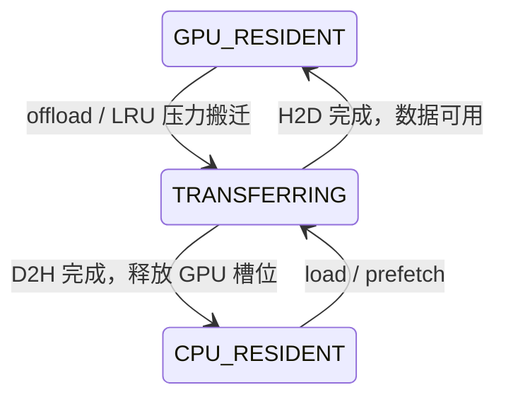

# v1.6–v1.8：GPU/CPU 分层、内存压力和预取

`TieredBlockManager` 在固定 GPU pool 上加入逻辑块身份、pinned CPU backing 和 residency LRU。Tier 0 是 GPU 显存，Tier 1 是 CPU DRAM；实际传输使用 CUDA H2D/D2H。测试机 RTX 3060 的显存是 GDDR6，这里的 GPU tier 不要求硬件必须使用 HBM。

## 身份和状态

`LogicalBlockHandle { id, generation }` 表示一个逻辑数据块。迁移只改变位置和物理 GPU 槽位，不改变逻辑句柄或请求引用。底层 `BlockHandle` 仍表示 GPU pool 的物理槽位，两种类型不能混用。释放后复用逻辑槽位会递增 generation，旧句柄失效。



`TRANSFERRING` 也包括等待 GPU 槽位的预取项。只有 `poll()` / `wait()` 收到传输完成结果后才改变可见状态；单独同步原始 CUDA stream 不会推进 manager 元数据。

第一版为每个逻辑槽位预分配一个 pinned CPU backing，包括当前在 GPU 的块。因此 `TieredBlockManager(8, 12, bytes, tokens)` 表示 **8 个 GPU 槽位、最多 12 个唯一逻辑块**，预留 CPU 内存 `12 * bytes`；不是 8+12 个唯一块。CPU backing 容量必须至少等于 GPU 容量，CPU 总容量耗尽时抛出 `CapacityError`。GPU resident 时 CPU 副本可能已过期，offload 始终拷回最新 GPU 数据。

## 接口与所有权

```cpp
kvflux::TieredBlockManager manager(8, 12, 4096, 16);
std::vector<unsigned char> input(4096, 42);
auto block = manager.create(input.data(), input.size());
manager.offload(block); // 提交 D2H，此时 location 是 TRANSFERRING
manager.wait();         // 此后 CPU_RESIDENT，GPU 槽位已经归还
manager.load(block);    // 提交 H2D，满池时先搬出一个 LRU 块
manager.wait();         // GPU_RESIDENT
{
    auto lease = manager.acquire_gpu(block); // 返回时 GPU 数据已经可读
    // 向 manager.compute_stream() 或调用方的 stream 提交使用 lease.data() 的 kernel。
    // 必须等待所有使用该地址的 kernel 完成，再离开作用域销毁 lease。
}
manager.release(block);
```

- `create` 同步创建完整块；`read_block` 同步读回整块并验证输入长度。
- `retain/release` 管理逻辑所有权。逻辑引用本身允许 offload，不保证 GPU 地址不变。
- `GpuLease` 增加一个独立逻辑引用并禁止迁移，支持移动；调用者可以先释放自己的引用。manager 必须比所有 lease 活得更久。
- `offload` 异步提交；已在 CPU 或正在 D2H 时不重复提交。反向迁移尚未结束时会等待。
- `load` 在有空位时异步提交；GPU 满时会等待传输并搬出 LRU，可能阻塞。
- `wait` 完成所有迁移及排队预取；`poll` 非阻塞检查完成情况并提交后续 H2D，返回是否全部完成。两者只处理传输，不等待调用方 kernel。
- manager 析构收尾传输，显式 `wait` 用于观察设备错误。本版只支持单 host 线程；句柄只能交给创建它的 manager，不能释放不属于调用方的内部引用。

## 内存压力与 v0 LRU 的连接

v0 与 v1 共用 `detail::IndexLru`，下标双向链表在构造时分配节点，touch/erase 无额外分配。

| 版本 | LRU 候选 | 容量不足时的操作 |
| --- | --- | --- |
| v0 | 引用数为零的缓存块 | 删除缓存身份并复用槽位 |
| v1 | 未被 lease 保护的 GPU resident 块 | D2H 保留数据，完成后复用 GPU 槽位 |

显式访问和最后一个 lease 结束会更新新旧顺序。在 GPU 容量 8、顺序创建 12 块时，逻辑块 0–3 在 CPU，4–11 在 GPU，共发生 4 次 offload，所有块仍有请求引用且数据完整。搬迁中的 GPU 槽位直到 D2H 完成才允许复用。所有 GPU 块都有 lease 时，demand load 抛出 `CapacityError`，预取跳过无法安排的块。

## Next-N 预取

`prefetch_next(order, current, next_n)` 查看 `order[current+1 ... current+next_n]`，忽略已 resident 或已经排队的块，返回本次新接纳的块数。重复块只接纳一次，超出序列末尾的窗口截断。

GPU 有空位时直接提交 H2D；满池时先对窗口之外的 LRU 块提交 D2H，并为对应预取块预约槽位。调度器在计算期间调用 `poll()`，D2H 完成后立刻提交排队 H2D。当前块、整个预取窗口以及所有 lease 都受到保护，避免窗口内互相驱逐；窗口超过容量时可能跳过部分预取。下一次 demand 的 `acquire_gpu` 会等待尚未完成的迁移。

示例见 [tiered_cache.cpp](../examples/tiered_cache.cpp)，真实计算窗口中的轮询见 [prefetch_benchmark.cpp](../benchmark/prefetch_benchmark.cpp)。没有后台 host 线程；如果不调用 `poll`，排队 H2D 会推迟到下一次 `wait` / demand。

## 构建和验收

以下命令对应本机 CUDA 12.4、GCC 13、SM 86；更换机器时调整编译器与架构。C++ 与 CUDA host compiler 使用同一版本，避免混合 libstdc++ 导致链接失败。请使用新的构建目录切换编译器。

```bash
cmake -S . -B build-v1.8 -DCMAKE_BUILD_TYPE=Release \
  -DCMAKE_CXX_COMPILER=/usr/bin/g++-13 \
  -DCMAKE_CUDA_HOST_COMPILER=/usr/bin/g++-13 -DCMAKE_CUDA_ARCHITECTURES=86 \
  -DKVFLUX_ENABLE_CUDA=ON -DKVFLUX_BUILD_TESTS=ON -DKVFLUX_BUILD_BENCHMARKS=ON
cmake --build build-v1.8 -j 4
ctest --test-dir build-v1.8 --output-on-failure
./build-v1.8/kvflux_tiered_demo
./build-v1.8/benchmark/kvflux_prefetch_benchmark benchmark/results/prefetch-local
compute-sanitizer --tool memcheck --leak-check full --error-exitcode 1 \
  ./build-v1.8/tests/kvflux_tiered_tests

python3 -m venv /tmp/kvflux-v18-plot
/tmp/kvflux-v18-plot/bin/python -m pip install -r scripts/requirements.txt
/tmp/kvflux-v18-plot/bin/python scripts/plot_prefetch_benchmarks.py benchmark/results/prefetch-local
```

测试覆盖 8/12 压力、随机顺序逐字节回读、GPU 修改后 offload、LRU touch、lease 嵌套/移动、全部 pinned 时拒绝、创建失败回滚、陈旧句柄、预取重复合并、仅用 poll 推进迁移，以及在途/排队块的最后引用释放。

## 计时口径

每块 1 MiB，GPU 容量 8，逻辑容量 12，访问 0–11 共 3 遍（36 次 demand）；初始 GPU 块为 4–11。比较无预取和 next-1/2/4，每个工作负载/模式预热一次，轮换顺序记录 7 个样本，中位数汇总。另记录逐块创建的压力轨迹。

- **Request stall time**：每次 `acquire_gpu` 的 host wall time 之和，包括按需 offload/load、传输等待和接口开销。
- **Total time**：完整请求循环和尾部传输收尾，包含预取提交、轮询和计算。
- **Scheduler CPU time**：预取及 `poll` 的调用耗时之和；不包含 CUDA query 循环的全部 CPU 消耗。
- 每次 demand 后运行独立 scratch 上的 fake compute，提供传输重叠窗口；另测 compute=0。所有模式执行同样的轮询逻辑，不插入 sleep。
- 初始化、分配、预热和最终逐字节数据校验在计时之外。基准中的 fake compute 不执行 attention，也不读取 KV；只衡量这个访问轨迹中的搬迁等待。

验收应同时查看 stall 和 total，预取可能增加调度开销或额外搬迁，计算窗口不足时不保证更快。测试不使用抖动敏感的性能断言；实际比较见 [RTX 3060 实测报告](../benchmark/results/rtx3060-prefetch/report.md)。本版没有将分层块表接入 v0 token/prefix 接口或真实模型调度器。
