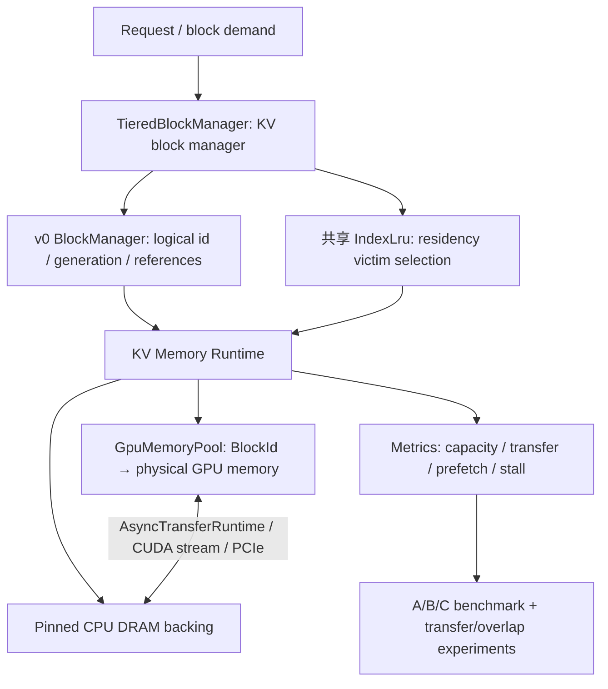

# KVFlux v1 完成验收（v1.10.0）

v1 的交付对象是单 GPU、GPU/CPU 两层的 KV block 内存运行时：从逻辑身份、引用与 LRU，到真实 GPU 槽位、异步传输、offload、prefetch 和可复现实验。它提供完整块接口，尚未执行模型 forward 或 attention。

## 最终系统

`LogicalBlockHandle` 独立于 GPU 槽位；GPU lease 保证外部 kernel 使用期间地址不被迁移。v0 的 allocator、generation、引用管理和 LRU 结构已被运行时复用；v0 的 token/prefix 模拟接口仍是独立入口，没有声称已经接入模型请求调度。Tier 0 泛指 GPU 显存；验收机 RTX 3060 使用 GDDR6，设计不依赖显存必须为 HBM。

## 五个 Epic 的交付证据

| Epic | 完成行为 | 代码与验收证据 |
| --- | --- | --- |
| E1 GPU Memory Pool | 一次连续显存分配、按物理 BlockId 定位、generation 防陈旧句柄、KV layout | [GPU pool](../src/gpu_memory_pool.cpp)、GPU/layout 测试 |
| E2 KV Transfer Runtime | 整块 H2D/D2H、初始化保护、逐字节回读 | [传输基准](../benchmark/results/rtx3060-v1/transfer/report.md) |
| E3 Async Runtime | Pinned memory、compute/transfer streams、batch、在途引用与 event 生命周期 | [异步 runtime](../src/async_transfer.cpp)、async 测试、Compute Sanitizer |
| E4 KV Offload | 稳定逻辑身份、三态位置、LRU 搬迁、lease、next-N 预取 | [分层实现](../src/tiered_block_manager.cpp)、tiered 测试、A/B/C 实验 |
| E5 Benchmark | 自有 metrics、180 个 A/B/C 样本、CSV、PNG/SVG、带宽/延迟/重叠/压力分析 | [最终报告](../benchmark/results/rtx3060-v1/report.md)、[复现命令](metrics_benchmarks.md) |

## 六个 Definition of Done 问题

**1. GPU KV Cache 怎么管理？**

固定容量 `GpuMemoryPool` 管理物理 GPU 槽位；`TieredBlockManager` 管理逻辑数据的 residency。A 的 100 块全部放入 GPU，660 次局部性访问中 offload=0、reload=0。

**2. Block 怎么映射真实显存？**

物理 `BlockId` 映射为 `base + id * block_bytes`。逻辑句柄通过 entry 找到物理 `BlockHandle`，`acquire_gpu()` 返回持有引用和迁移保护的地址。GPU 测试验证槽位地址、复用后的 generation 和回读一致性。

**3. GPU 满了怎么办？**

LRU 选择无 lease 的 GPU 块，提交 D2H；完成后释放 GPU 槽位，数据留在 CPU。B（80/100）的局部性实验发生 300 次 offload，C（30/100）发生 660 次；计时不包含初始化额外的 20/70 次 offload。

**4. 后面又需要这个 block 怎么办？**

按需 H2D reload，或提前预取。每次正式样本完成后回读全部 100 块验证内容；迁移不改变逻辑句柄。无预取时，B/C 分别 reload 300/660 次。

**5. 怎么降低传输开销？**

复用 pinned memory、异步 stream、batch、event 和 next-N 预取。有计算窗口时，B 的 next-1 stall 从 99.66 ms 降到 0.35 ms，C 从 219.98 ms 降到 0.35 ms；C 总耗时从 977.03 ms 降到 757.62 ms。

**6. 优化到底有没有意义？**

本机 256 MiB H2D：pageable **5.64 GB/s**，pinned direct **6.95 GB/s**，包含 staging **4.82 GB/s**。Pinned direct 有收益，额外 staging 仍可能使端到端路径更慢。

16 MiB H2D + 独立模拟计算：同步 **3.595 ms**，异步 **2.444 ms**；CUDA event 区间 overlap ratio 为 **100%**，含义是较短区间被覆盖，不是 GPU 利用率。32 块 batch 的 H2D 从 **6.68 GB/s** 到 **6.88 GB/s**，不是线性提升。

无计算、无预取的局部性实验：A/B/C 总耗时 **0.25 / 100.08 / 220.89 ms**。C 的 D2H/H2D event 平均约 **162.95 / 158.41 µs/块**，带宽 **6.43 / 6.62 GB/s**，累计传输 event 时间约占总耗时 **96%**。这支持本工作负载主要受传输路径限制的判断，不代表已经测得物理 PCIe 链路利用率。

## Thrashing 是已观测到的限制

C 的 660 次访问产生 660 次 D2H 和 660 次 H2D，共 **1320 MiB** 流量，平均每个 demand 两次迁移。Next-1 把等待移入计算窗口，流量仍是 1320 MiB。

循环扫描 `[0..99] * 3` 中，B 和 C 都是 300 次 offload + 300 次 reload；80% 容量也不等于 80% 命中。热集合是否放得下、复用距离、计算窗口以及搬迁带宽共同决定性能。后续可基于这些基线研究避免扫描污染、保留有效 CPU 副本、选择性预取和更细粒度的完成回收。

## 验证与范围

CPU 构建 **2/2** 测试通过，CUDA 构建 **5/5** 测试通过，异步与分层路径的 Compute Sanitizer 检查均为 **0 errors / 0 bytes leaked**。180 个 A/B/C 正式样本全部通过逐字节检查和 metrics 守恒检查。原始文件、测量环境、访问序列和绘图脚本已保存。

所有性能数字来自 RTX 3060 Laptop 的合成 block demand，计算是独立 scratch kernel；它们不代表 LLM 请求吞吐或真实 attention 的收益。v1 不包含：

- PagedAttention CUDA kernel、Transformer forward、continuous batching。
- Distributed KV Cache、RDMA、NVMe、多 GPU。
- vLLM plugin、SGLang integration。
- KV compression、quantized KV cache。

这些范围外的功能不作为 v1 完成的前置条件。v1 的五个 Epic 和六项验收已在上述单 GPU 内存运行时边界内完成。
