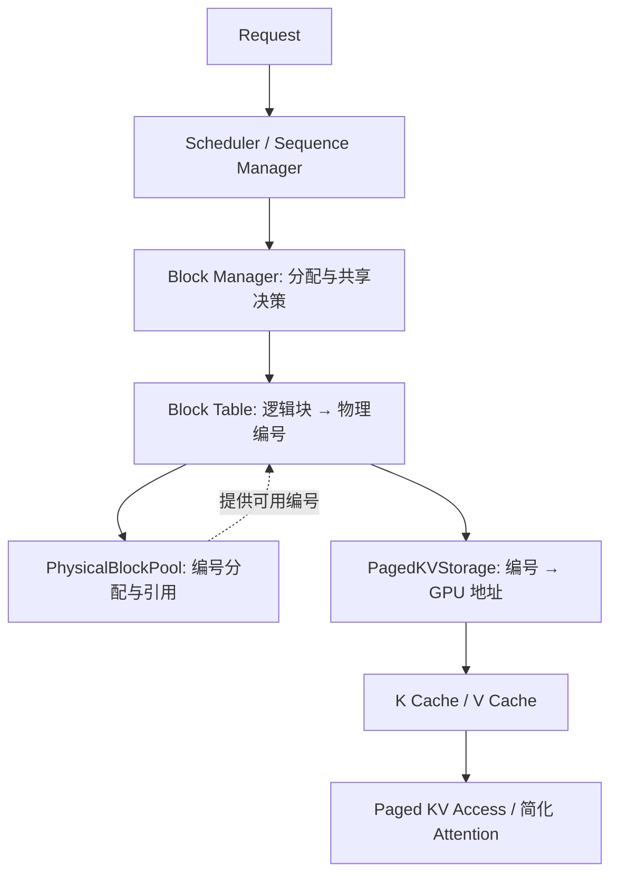

# v2 Milestone 1：Physical Block Pool

这一阶段把 v0 的槽位分配器用于 v2 的 GPU KV **物理页编号**。可以先在普通 CPU 上运行，因为物理页池只保存元数据，不申请显存。

## v2 要连接的调用链



例如一个请求的第 0、1、2 个块是**逻辑位置**，block table 将它们映射到物理编号 `7、3、9`。当多个请求共享同一段 KV 时，可以在各自的表中指向同一物理编号，并为它增加引用。[v2 Block Table](v2_block_table.md) 已实现这层映射，[Paged KV Storage](v2_paged_kv_storage.md) 已实现 GPU 地址换算；计算层继续沿调用链接入。

## 编号与地址

假设池容量为 1024、每页 16 个 token，物理编号就是 `0..1023`。`capacity` 是**页数**，`block_size` 是**每页 token 数**，两者都不是字节数。`PhysicalBlockID` 是下标，不是 CUDA 指针，也不能单独证明调用方拥有这一页。

`allocate()` 返回 `PhysicalBlockHandle{id, generation}`。其中 `id` 决定访问 GPU KV 存储的哪一页；`generation` 在该页重新分配时递增，防止旧句柄被误用。使用 `pool.id(handle)` 取得经过校验的编号；[Paged KV Storage](v2_paged_kv_storage.md) 再把编号和 K/V 布局换算成设备地址。

```cpp
kvflux::PhysicalBlockPool pool(1024, 16);
auto a = pool.allocate(); // id 0
auto b = pool.allocate(); // id 1
auto c = pool.allocate(); // id 2
pool.free(b);
auto d = pool.allocate(); // 再次使用 id 1，generation 已变化
pool.free(a);
pool.free(c);
pool.free(d);
```

实际运行：

```bash
cmake -S . -B build -DKVFLUX_BUILD_TESTS=ON
cmake --build build -j 2
ctest --test-dir build --output-on-failure
./build/kvflux_physical_pool_demo
```

## 与 v0 / v1 的关系

`PhysicalBlockPool` 内部直接复用 v0 `BlockManager` 的 free list、引用计数、容量错误和 generation 校验。这里不调用 `publish`，所以没有前缀缓存：引用归零后直接进入 free list，下一次分配可以复用编号。`retain(handle)` 增加一个引用，每次 `allocate` 或 `retain` 都要配对一次 `free`。池满且没有可回收页时，`allocate` 抛出 `CapacityError`。

v1 的 `GpuMemoryPool` 继续承担原有连续显存、同步读写和前缀缓存功能。v2 的物理页池独立管理编号和引用，让元数据与存储地址明确分开。`PagedKVStorage` 复用 v1 的一次性显存分配，并依据 v2 物理编号定位 K/V；物理页池自身无需知道 CUDA 地址。

本类自身不保存请求，也不执行 paged attention 或 CUDA kernel。句柄仅在创建它的池内有效；普通复制不增加引用，也不能跨线程直接操作。GPU kernel 若仍在使用某一页，调用方必须等它完成后再释放最后一个引用；目前尚无异步生命周期管理。
